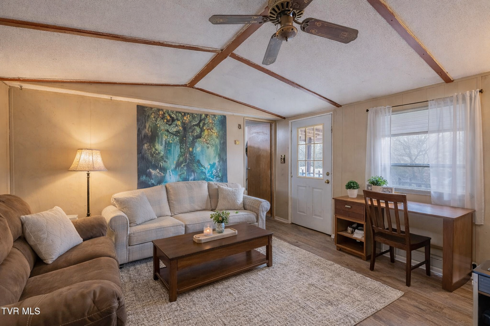
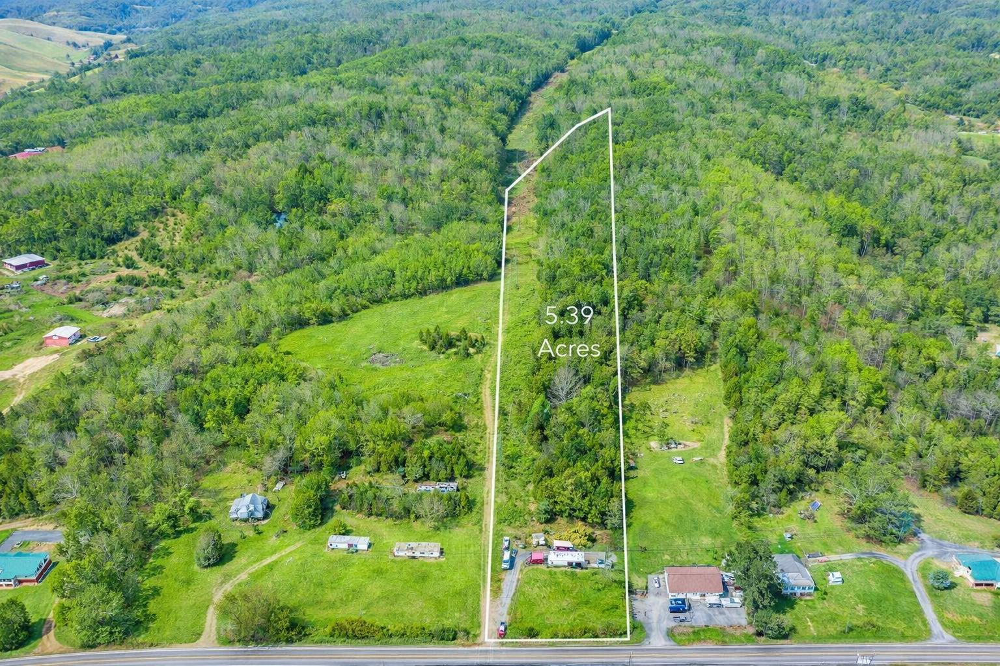

# Deploying the Shocks Family Farm Listing

This project is now set up as a simple static site:

- `index.html`
- `images/`
- `DEPLOY-INSTRUCTIONS.md`

No build step, no framework, no npm install required for Vercel or GitHub Pages.

## Go Live in 2 Minutes

1. Put the whole `shocks-farm-site` folder in a GitHub repo.
2. Push it to GitHub.
3. Go to [vercel.com](https://vercel.com) and create a New Project.
4. Connect the repo.
5. Choose `Other` for the framework preset.
6. Click `Deploy`.

That is enough to get a live URL.

## What Is Already Done

- The YouTube embed for `https://youtu.be/48tz_8NZp5c` is already on the page right before the CTA.
- The photo placeholders have been replaced with actual listing photos.
- Owner email buttons were converted to plain `mailto:` links so the page works on Vercel, GitHub Pages, and Railway without Cloudflare email protection.

## Folder Structure

```text
shocks-farm-site/
├── DEPLOY-INSTRUCTIONS.md
├── index.html
└── images/
    ├── aerial-property.png
    ├── bathroom.png
    ├── exterior-red-barn.png
    ├── kitchen.webp
    ├── living-room.png
    ├── open-living-kitchen.png
    ├── primary-bedroom.png
    └── second-bedroom-office.png
```

`open-living-kitchen.png` is included in case you want to swap it into the gallery later.

## Recommended: GitHub to Vercel

### Step 1: Put the Site in Its Own Folder

If you are already in the finished project folder, skip this. The live site should deploy from the folder that contains `index.html` and `images/`.

### Step 2: Create a GitHub Repo and Push

Run these commands inside the project folder:

```bash
cd /path/to/shocks-farm-site
git init
git add .
git commit -m "Initial farm listing site"
git branch -M main
git remote add origin https://github.com/YOUR_USERNAME/shocks-farm-site.git
git push -u origin main
```

If GitHub asks you to create the repo first, do that in the browser, then come back and run the same commands.

### Step 3: Deploy on Vercel

1. Open [vercel.com](https://vercel.com)
2. Click `Add New...` then `Project`
3. Import your `shocks-farm-site` repository
4. For `Framework Preset`, choose `Other`
5. Leave Build Command empty
6. Leave Output Directory empty
7. Click `Deploy`

Vercel will generate a live URL like:

```text
https://shocks-farm-site.vercel.app
```

### Step 4: Optional Custom Domain

In Vercel:

1. Open the project
2. Go to `Settings`
3. Go to `Domains`
4. Add your custom domain

## GitHub Pages Option

GitHub Pages works well too because the site already uses `index.html`.

### Push the Same Repo

```bash
cd /path/to/shocks-farm-site
git init
git add .
git commit -m "Initial farm listing site"
git branch -M main
git remote add origin https://github.com/YOUR_USERNAME/shocks-farm-site.git
git push -u origin main
```

### Turn On Pages

1. Open the repo on GitHub
2. Click `Settings`
3. Click `Pages`
4. Under `Build and deployment`, choose `Deploy from a branch`
5. Select branch `main`
6. Select folder `/root`
7. Click `Save`

Your site will appear at:

```text
https://YOUR_USERNAME.github.io/shocks-farm-site/
```

## Railway Option

Railway is more than you need for a static site, but it works.

### Push the Repo First

Use the same Git commands above.

### Deploy in Railway

1. Open [railway.app](https://railway.app)
2. Click `New Project`
3. Choose `Deploy from GitHub repo`
4. Select your repo
5. If Railway asks for a start command, use:

```bash
npx serve . -l $PORT
```

If Railway does not auto-detect correctly, add a `railway.json` file in the repo root:

```json
{
  "$schema": "https://railway.app/railway.schema.json",
  "deploy": {
    "startCommand": "npx serve . -l $PORT"
  }
}
```

## Local Preview

If you want to test the site before pushing:

```bash
cd /path/to/shocks-farm-site
python3 -m http.server 8000
```

Then open:

```text
http://localhost:8000
```

## Current Photo Mapping

These images are already wired into the page:

1. `.mo.a` uses `images/aerial-property.png`
2. `.mo.b` uses `images/exterior-red-barn.png`
3. `.mo.c` uses `images/living-room.png`
4. `.mo.d` uses `images/kitchen.webp`
5. `.mo.e` uses `images/bathroom.png`
6. `.mo.f` uses `images/primary-bedroom.png`
7. `.mo.g` uses `images/second-bedroom-office.png`
8. `.lph` uses `images/aerial-property.png`

## How to Swap Photos Later

The photo mosaic is in `index.html`.

Current markup looks like this:

```html
<div class="mo c">
  
  <div class="moc"><span>Living Room · Cathedral Ceiling</span></div>
</div>
```

To swap an image:

1. Put the new image into `images/`
2. Update the `src`
3. Update the `alt`
4. Update the caption inside `<span>`

Example:

```html
<div class="mo c">
  
  <div class="moc"><span>Living Room · Fresh Staging</span></div>
</div>
```

For the large land image, find:

```html
<div class="lph">
  
</div>
```

## Codex / AI Agent System Prompt

Paste this into Codex or another coding agent if you want it to make edits without breaking the page structure:

```text
You are working on a single-project static property listing site for
1431 Highway 70 N, Rogersville, TN 37857 — the Shocks family farm.

FILES:
- index.html
- images/
- DEPLOY-INSTRUCTIONS.md

TECH STACK:
- Pure HTML5, CSS3, and vanilla JavaScript only
- No framework
- No build tools
- No external CSS or JS files
- All CSS lives in one <style> block in <head>
- All JS lives in one <script> block at the bottom of <body>
- Keep the page deployable as a static site on Vercel, GitHub Pages, or Railway

DESIGN SYSTEM:
- Keep the current theatrical, handcrafted, Appalachian-poster visual style
- Preserve the existing fonts, colors, motion, and section sequencing
- Do not flatten the design into a generic real-estate template

GOOGLE FONTS IN USE:
- Cinzel Decorative
- Uncial Antiqua
- Yellowtail
- Playfair Display
- Libre Baskerville
- Rye

CSS VARIABLES TO PRESERVE:
- --void: #0d0818
- --dp: #1a0832
- --pur: #3d1266
- --teal: #0b5e5a
- --tealmd: #0f7a74
- --tlt: #15a89e
- --gold: #c9940a
- --sun: #e8b90f
- --bg: #f5d020
- --amber: #d4700a
- --rust: #a83010
- --grn: #1a4d1a
- --grnmd: #266026
- --mag: #a81858
- --mlt: #d42070
- --cream: #f4edd8
- --ink: #100820

CONTACTS THAT MUST STAY CORRECT:
- Agent: Ward Tanner
- Phone: 423-561-3718
- Griffin Home Group: https://www.griffinhomegroup.com/agents/ward-tanner/
- Facebook: https://www.facebook.com/p/Ward-Tanner-Realtor-100083003881185/
- Homes.com: https://www.homes.com/real-estate-agents/ward-tanner/w03vz6l/
- Owner: Rachelle Shock
- Rachelle phone: 828-273-7242
- Rachelle email: rachelleshock@gmail.com
- Owner: Andrew Shock
- Andrew phone: 570-460-4027
- Andrew email: shockflooring@gmail.com
- MLS: #9990264
- Realtor.com listing: https://www.realtor.com/realestateandhomes-detail/1431-Highway-70-N_Rogersville_TN_37857_M71955-75676

FAMILY DETAILS TO PRESERVE:
- Rachelle Shock is spelled Rachelle, not Rachel
- Rachelle: former tennis pro, breast cancer survivor, earth mama
- Andrew: half Filipino, builder, swimmer, recovery advocate
- Riley: 19, pursuing electrician apprenticeship/licensure
- Landon: 16, straight-A student at Cherokee High
- Willow: 9, competitive tennis player, homeschooled

PROPERTY FACTS TO PRESERVE:
- 5.39 unrestricted acres
- 2 bed / 1 bath
- 700 square feet
- 1986 single-wide
- $98,900 asking price
- Reduced from $105,000
- $264 annual taxes
- No HOA
- Highway 70 N frontage
- Hawkins County, Tennessee

VIDEO:
- Keep the YouTube embed section before the CTA
- Video URL: https://www.youtube.com/embed/48tz_8NZp5c

SECTION ORDER TO PRESERVE:
1. Hero
2. Stats bar
3. Story / family section
4. Photo mosaic
5. Land and opportunity
6. Home improvements
7. Extras
8. Owner financing
9. Community / Rogersville / distances / local life
10. Hawkins County freedom
11. We are also looking for home
12. YouTube section
13. CTA and contact cards

INTERACTIONS TO PRESERVE:
- Custom gold cursor and ring
- Sunflower cursor trail
- Scroll progress bar
- Floating particle field
- Scroll reveal animations
- Counter animations in the stats bar
- Hover lifts and glows

IMAGE RULES:
- Use relative paths from the images/ folder
- Keep alt text specific and descriptive
- Keep captions inside .moc span aligned to the actual image
- Do not replace real listing images with placeholder gradients

EMAIL RULES:
- Use plain mailto: links for owner emails
- Do not add Cloudflare email obfuscation markup

EDITING RULES:
- Keep the page self-contained
- Preserve responsiveness
- Preserve section order unless explicitly asked to change it
- Preserve the current voice: emotional, direct, human, not corporate
- If you add a new image, copy it into images/ and update the corresponding  tag
```

## Pre-Launch Checklist

- [ ] Confirm `index.html` sits at the root of the repo
- [ ] Confirm the `images/` folder is committed too
- [ ] Open the page locally and make sure every image loads
- [ ] Test the YouTube embed
- [ ] Test all `tel:` links
- [ ] Test both `mailto:` links
- [ ] Test the Griffin Home Group link
- [ ] Test the Realtor.com link
- [ ] Test the Google Maps directions link
- [ ] Check the site on mobile width
- [ ] Push to GitHub
- [ ] Deploy to Vercel or GitHub Pages

## Troubleshooting

### Blank homepage

Make sure the file is named `index.html` and is in the repo root.

### Images missing

Make sure the `images/` folder was committed and pushed with the HTML file.

### Emails do not open

The current page already uses plain `mailto:` links. If they ever stop working, check that they were not replaced with Cloudflare-protected markup.

### GitHub Pages CSS or images not loading

Check path case exactly. `images/` is lowercase and filenames are lowercase.

## Final Note

The fastest production path is still:

1. Push this folder to GitHub
2. Import it into Vercel
3. Deploy as `Other`

That is the cleanest path for this site.
